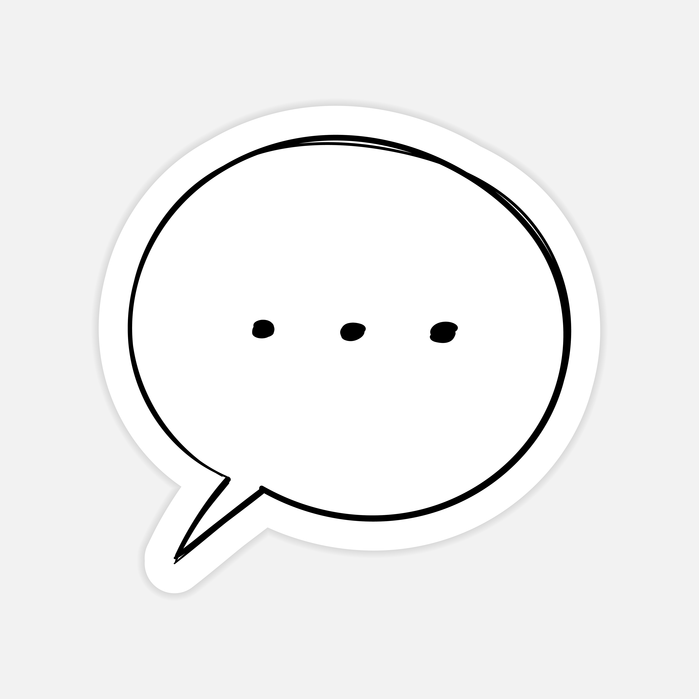

<!-- Improved compatibility of back to top link: See: https://github.com/othneildrew/Best-README-Template/pull/73 -->
<a name="readme-top"></a>
<!--
*** Thanks for checking out the Best-README-Template. If you have a suggestion
*** that would make this better, please fork the repo and create a pull request
*** or simply open an issue with the tag "enhancement".
*** Don't forget to give the project a star!
*** Thanks again! Now go create something AMAZING! :D
-->


<!-- PROJECT SHIELDS -->
<!--
*** I'm using markdown "reference style" links for readability.
*** Reference links are enclosed in brackets [ ] instead of parentheses ( ).
*** See the bottom of this document for the declaration of the reference variables
*** for contributors-url, forks-url, etc. This is an optional, concise syntax you may use.
*** https://www.markdownguide.org/basic-syntax/#reference-style-links
-->
[![Contributors][contributors-shield]][contributors-url]
[![Forks][forks-shield]][forks-url]
[![Stargazers][stars-shield]][stars-url]
[![Issues][issues-shield]][issues-url]
[![MIT License][license-shield]][license-url]
[![LinkedIn][linkedin-shield]][linkedin-url]


<!-- PROJECT LOGO -->
<br />
<div align="center">
  <a href="https://github.com/tamaskogabo/firstChatApp">
    
  </a>

<h3 align="center">Real-time chatroom</h3>

  <p align="center">
    One of my first pet projects, a full stack live chat application, using Websocket
connection, React frontend and Spring Boot backend. The most interesting part of it,
was learning a lot about the Websocket technology, and how to manage it on both the
backend and frontend.
    <br />
    <a href="https://github.com/tamaskogabo/firstChatApp"><strong>Explore the docs »</strong></a>
    <br />
    <br />
    <a href="https://github.com/tamaskogabo/firstChatApp">View Demo</a>
    ·
    <a href="https://github.com/tamaskogabo/firstChatApp/issues">Report Bug</a>
    ·
    <a href="https://github.com/tamaskogabo/firstChatApp/issues">Request Feature</a>
  </p>
</div>


<!-- TABLE OF CONTENTS -->
<details>
  <summary>Table of Contents</summary>
  <ol>
    <li>
      <a href="#about-the-project">About The Project</a>
      <ul>
        <li><a href="#built-with">Built With</a></li>
      </ul>
    </li>
    <li>
      <a href="#getting-started">Getting Started</a>
      <ul>
        <li><a href="#prerequisites">Prerequisites</a></li>
        <li><a href="#installation">Installation</a></li>
      </ul>
    </li>
    <li><a href="#usage">Usage</a></li>
    <li><a href="#roadmap">Roadmap</a></li>
    <li><a href="#contributing">Contributing</a></li>
    <li><a href="#license">License</a></li>
    <li><a href="#contact">Contact</a></li>
    <li><a href="#acknowledgments">Acknowledgments</a></li>
  </ol>
</details>


<!-- ABOUT THE PROJECT -->
## About The Project

![Product Name Screen Shot][product-screenshot]

<p align="right">(<a href="#readme-top">back to top</a>)</p>


### Built With

-   [![React][React.js]][React-url]
-   [![Javascript][Javascript]][Javascript-url]
-   [![Java][Java]][Java-url]
-   [![Spring][Spring]][Spring-url]
-   [![Tomcat][Tomcat]][Tomcat-url]
-   [![CSS][CSS]][CSS-url]
-   [![Docker][Docker]][Docker-url]

<p align="right">(<a href="#readme-top">back to top</a>)</p>


<!-- GETTING STARTED -->
## Getting Started

To get a local copy up and running follow these simple example steps.

### Prerequisites

* npm
  ```sh
  npm install npm@latest -g
  ```
* Install JDK:
https://www.oracle.com/java/technologies/downloads/
* Install Maven:
https://maven.apache.org/install.html
* Install Docker Desktop:
https://www.docker.com/products/docker-desktop/

### Installation

1. Clone the repo
   ```sh
   git clone https://github.com/tamaskogabo/firstChatApp.git
   ```
2. Install NPM packages in the firstchatappfrontend folder
   ```sh
   npm install
   ```
3. Create a react build
   ```sh
   npm run build
   ```
4. Copy the newly created build folder's contents from the firstchatappfrontend directory to the /firstChatApp/src/main/resources/static folder. (Static folder might have to be created in resources!)

5. Create a compiled .jar file, using Maven in the firstChatApp folder
   ```sh
   mvn package
   ```

6. Run the batch file in the firstChatApp folder, while docker is up and running.
   ```sh
   .\chatapp-build-run.bat
   ```
7. Check out the running application on http://localhost:8080

Hint: In order to make it available for other devices on your local network, you might have to turn off your firewall to make the port accessable on the host computer.


<p align="right">(<a href="#readme-top">back to top</a>)</p>


<!-- USAGE EXAMPLES -->
## Usage

The app can be used for real-time chatting on local network, supporting private chat-rooms and one public chat room, where everybody can post their thoughts. It can be used to study about the most basic use-case of the WS technology in a simple, but instructive environment.

<p align="right">(<a href="#readme-top">back to top</a>)</p>


<!-- ROADMAP -->
## Roadmap

- [ ] Create backend implementation with Spring-Boot, WebSocketMessageBroker, and Stomp endpoint
- [ ] Implement and connect the React frontend to the server, using SockJS, and stompClient
- [ ] Test copy the frontend build to the backend, to make it work with the Tomcat server
- [ ] Dockerize the application for easier installation and use

See the [open issues](https://github.com/tamaskogabo/firstChatApp/issues) for a full list of proposed features (and known issues).

<p align="right">(<a href="#readme-top">back to top</a>)</p>


<!-- CONTRIBUTING -->
## Contributing

Contributions are what make the open source community such an amazing place to learn, inspire, and create. Any contributions you make are **greatly appreciated**.

If you have a suggestion that would make this better, please fork the repo and create a pull request. You can also simply open an issue with the tag "enhancement".
Don't forget to give the project a star! Thanks again!

1. Fork the Project
2. Create your Feature Branch (`git checkout -b feature/AmazingFeature`)
3. Commit your Changes (`git commit -m 'Add some AmazingFeature'`)
4. Push to the Branch (`git push origin feature/AmazingFeature`)
5. Open a Pull Request

<p align="right">(<a href="#readme-top">back to top</a>)</p>


<!-- LICENSE -->
## License

Distributed under the MIT License. See `LICENSE.txt` for more information.

<p align="right">(<a href="#readme-top">back to top</a>)</p>


<!-- CONTACT -->
## Contact

Gábor Tamaskó - tamaskogabo@gmail.com

Project Link: [https://github.com/tamaskogabo/firstChatApp](https://github.com/tamaskogabo/firstChatApp)

<p align="right">(<a href="#readme-top">back to top</a>)</p>


<!-- ACKNOWLEDGMENTS -->
## Acknowledgments

* [] Thanks for Codecool for guiding me on my journey to learn coding
* [] Thanks for my mentor Réka Beáta Bujdosó, for suggesting the idea of learning a bit about websockets
* [] Thanks for InvolveInInnovation channel on YT, for the video guidance: https://www.youtube.com/watch?v=o_IjEDAuo8Y&t=34s

<p align="right">(<a href="#readme-top">back to top</a>)</p>


<!-- MARKDOWN LINKS & IMAGES -->
<!-- https://www.markdownguide.org/basic-syntax/#reference-style-links -->
[contributors-shield]: https://img.shields.io/github/contributors/tamaskogabo/firstChatApp.svg?style=for-the-badge
[contributors-url]: https://github.com/tamaskogabo/firstChatApp/graphs/contributors
[forks-shield]: https://img.shields.io/github/forks/tamaskogabo/firstChatApp.svg?style=for-the-badge
[forks-url]: https://github.com/tamaskogabo/firstChatApp/network/members
[stars-shield]: https://img.shields.io/github/stars/tamaskogabo/firstChatApp.svg?style=for-the-badge
[stars-url]: https://github.com/tamaskogabo/firstChatApp/stargazers
[issues-shield]: https://img.shields.io/github/issues/tamaskogabo/firstChatApp.svg?style=for-the-badge
[issues-url]: https://github.com/tamaskogabo/firstChatApp/issues
[license-shield]: https://img.shields.io/github/license/tamaskogabo/firstChatApp.svg?style=for-the-badge
[license-url]: https://github.com/tamaskogabo/firstChatApp/blob/master/LICENSE.txt
[linkedin-shield]: https://img.shields.io/badge/-LinkedIn-black.svg?style=for-the-badge&logo=linkedin&colorB=555
[linkedin-url]: https://linkedin.com/in/tamaskogabo
[product-screenshot]: images/chatapp.jpg
[Javascript]: https://img.shields.io/badge/javascript-F7DF1E?style=for-the-badge&logo=javascript&logoColor=white
[Javascript-url]: https://developer.mozilla.org/en-US/docs/Web/JavaScript
[Spring]: https://img.shields.io/badge/spring-6DB33F?style=for-the-badge&logo=spring&logoColor=white
[Spring-url]: https://spring.io/
[React.js]: https://img.shields.io/badge/React-20232A?style=for-the-badge&logo=react&logoColor=61DAFB
[React-url]: https://reactjs.org/
[Java]: https://img.shields.io/badge/java-F80000?style=for-the-badge&logo=oracle&logoColor=white
[Java-url]: https://www.oracle.com/java/
[Tomcat]: https://img.shields.io/badge/apachetomcat-20232A?style=for-the-badge&logo=apachetomcat&logoColor=F8DC75
[Tomcat-url]: https://tomcat.apache.org/
[CSS]: https://img.shields.io/badge/css3-gray?style=for-the-badge&logo=css3&logoColor=1572B6
[CSS-url]: https://developer.mozilla.org/en-US/docs/Web/CSS
[Docker]: https://img.shields.io/badge/docker-white?style=for-the-badge&logo=docker&logoColor=2496ED
[Docker-url]: https://www.docker.com/
